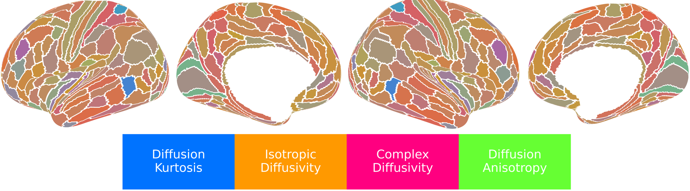

##### Download

+ [Paper](https://www.nature.com/articles/s42003-025-08523-9)
+ [Code and data](https://github.com/ucsfncl/diffusion_neuromaps)
+ [Blog post] (https://communities.springernature.com/posts/mapping-the-human-cortex-in-vivo-with-diffusion-mri)

---

##### Abstract

Despite advances in diffusion MRI, which have led to remarkable progress in mapping white matter of the living human brain, our understanding of cerebral cortical microstructure in vivo and its relationship to macrostructure, myeloarchitecture, cytoarchitecture, chemoarchitecture, metabolism, and function lag far behind. We present neuromaps of 21 microstructural metrics derived from diffusion tensor, diffusion kurtosis, mean apparent propagator, and neurite orientation dispersion and density imaging of the young adult cerebral cortex. These 21 metrics are explained by four composite factors that correspond to diffusion kurtosis (intracellular volume fraction/neurite density), isotropic diffusion (free water fraction), heterogenous diffusion (extracellular volume fraction) and diffusion anisotropy (neurite orientation dispersion). We demonstrate how cortical microstructure follows cytoarchitectural and laminar differentiation, aligns with the macroscale sensory-fugal and sensorimotor-association axes, and contributes to functional brain networks, neural oscillatory dynamics, neurotransmitter receptor/transporter distributions, and cognition and behavior.

---

##### Figure 2: Mapping the human cortex in vivo with diffusion MRI

